# Legislative Coordination and Institutional Change: A Bipartite Network Analysis of Coalition Dynamics in the Brazilian Chamber of Deputies

> POLNET 2026 conference version. Short paper presented at the 19th Political Networks Conference, University of Manchester, August 2026. Figures are in `../figures/`; the appendices are in `appendices.md`; the analysis pipeline and a reproducibility note are in `../scripts/` and `reproducibility.md`.

## Abstract

How does a polarized multiparty legislature remain governable without party-system collapse or programmatic realignment? Standard typologies of party-system change do not address this combination, and the Brazilian Chamber of Deputies after 2014 is a clear instance of it. Using two decades of roll-call voting (2003–2026), this paper reconstructs legislative coordination as bipartite networks of agreement and shows that the chamber organizes by position relative to the executive of the day, not along a fixed ideological axis. Its pragmatic center, the Centrão, is a long-standing governista bloc whose position shifted during the 2014–2016 crisis: once a disciplined agent of the presidency, it became an autonomous pivot that sits in the largest coordinating community under every government and, net of the president's party, supplies the marginal majority on contested votes. Because the institutional shocks are collinear, the design eliminates the main observable rivals (turnover, agenda control, a fiscal channel) instead of estimating a single causal effect. The case identifies a mode of party-system change the standard categories miss: structural reorganization of legislative coordination without collapse.

Keywords: Brazilian Chamber of Deputies, coalitional presidentialism, governismo, legislative networks, pivot parties, polarization, community detection.

---

# 1. Introduction

Polarization is supposed to make legislatures harder to govern. As the parties move apart and the middle empties, the votes needed to build a majority should become scarce, and gridlock or instability the expected result. The Brazilian Chamber of Deputies, over the past decade, produced the first half of that story without the second. There has been a broader rebalancing of executive–legislative relations toward legislative protagonism and, in this scenario, the party system became even more polarized and the programmatic center hollowed out. Notwithstanding, the chamber kept assembling majorities for one government after another, across an impeachment and a change of power, not without the costs of avoiding possible deadlocks. Governability increasingly had to be bought from a non-programmatic pivot instead of commanded from a coalition, and that degrades  how the system governs even where it stops short of gridlock. This paper asks how a polarizing legislature stays governable, and at what cost.

That qualifier needs stating plainly at the outset, because it might be reasonable to ask what is wrong with a bloc aligning with the executive of the day. Under coalitional presidentialism, joining the government is expected behavior, and a disciplined governing coalition is how the system was long understood to work (Figueiredo & Limongi, 2000). The concern here is narrower. When the bloc that supplies the majority does so without a programmatic basis, aligning with whichever side governs and keeping its own position out of view, governability comes to be sold rather than represented. A pivot available to any government in exchange for office and budget is, by the same token, difficult to hold to account at the ballot box, because the low programmatic profile that keeps it available also shields it from retrospective sanction (Katz & Mair, 2009; Przeworski et al., 1999). The cost is therefore one of representation more than of gridlock, a point the paper develops in the Discussion (§6.3).

The existing efforts fall short in a revealing way. The Brazilian literature on the crises of coalitional presidencialism (Abranches, 2018; Guimarães et al., 2019) describes the post-2014 period vividly: coalitions that stopped sustaining themselves, an executive that lost its grip, a chamber that became its own arena of negotiation. It does not measure what in the chamber's structure changed. The comparative literature on Latin American party systems (Mainwaring & Scully, 1995; Mainwaring, 2018; Lupu, 2014) catalogues the ways a system can change, from collapse to hyper-fragmentation to programmatic realignment to institutionalization, yet the Brazilian case fits none of these cells: the parties did not die, intra-party discipline did not break, and still the architecture coordinating them was redrawn. The standard instrument for reading roll-call data compounds the problem. Ideal-point estimation assumes that ideology organizes voting and that change shows up as movement along a left–right axis, so by construction it cannot see a chamber whose blocs recompose while ideology might show strong features of polarization. There is a structural question open: how the chamber's coordination reorganized after these shocks, and what happened to its pragmatic center. 

Recorded floor votes are the behavioral trace of how the chamber actually assembles its majorities, and the only such record available consistently across two decades; they are, accordingly, the standard evidence for studying legislative coordination, with the selection of which matters reach a recorded vote treated directly in the Data section.

The Brazilian Chamber coordinates by position relative to the executive of the day, not along a fixed ideological axis, and its pragmatic center, the Centrão, is the main organizational expression of that logic. The Centrão is old, it did not emerge in the crisis. What the 2014–2016 window changed is its position. Before, it was a disciplined agent of the presidency, paid in budget and posts for the votes it delivered. After, it became an autonomous pivot the government must court: in the winning coalition under every president, and, net of the president's own party, decisive in supplying the marginal majority on the votes that are actually contested. This is the channel through which a polarizing system stays governable. It is not a program that bridges the poles, but a non-ideological center that sells governability to whoever governs, at a price that rises as the poles harden (the budget side of that price is read here from the institutional record and developed in a companion analysis). Over the same period the bloc did not only reposition but grew, from roughly a fifth of the chamber in 2003 to about two-thirds by 2023. Because the Centrão is an analytical category, one might worry that the pattern is an artifact of how it is drawn; it is not, since the set is sourced and dated from party attributes rather than from votes, and the result holds across six alternative membership schemes (§5.8). 

The contribution is twofold. The first is measurement. Where the literature renders the Centrão's permanence as narrative, this paper recovers it from two decades of roll-call voting as a longitudinal, network-based quantity: its position, its persistence across an alternation in power, and its weight on the contested votes. The second is the inferential design. Because the reorganization coincides with a cluster of shocks that no model can cleanly pull apart, this paper does not try to estimate the effect of any one of them. It proceeds by elimination instead: the competing explanations, taken one at a time, namely turnover, agenda manipulation, and a single fiscal channel, each fail to account for the result, and what remains is a structural claim none of them explains away. 

The three correspond to the rival accounts the literature and the data make observable: that the change is compositional rather than behavioral (turnover), that it is an artifact of who controlled the floor agenda (the Cunha chamber presidency), and that it runs through the one executive lever the 2015 reform actually closed (the fiscal channel). Each maps to a check the design can run directly; what no observable test can isolate, the marginal effect of the amendment reform itself, is flagged as such, not asserted. The approach is portable to other fragmented legislatures where the usual multivariate tools cannot be identified. These two contributions connect to a comparative literature that is already partly in place. 

The case appears to belong to a type that literature has noticed but that the standard typologies of party-system change do not name: a low-programmatic bloc that outlasts an alternation in power by staying available to whoever governs, so that a system can reorganize its coordination without collapsing, realigning along program, or losing intra-party discipline. That type has been described in other fragmented systems, mostly narratively. Following that lead, this paper tries a further step: to recover a governing pivot's position, and its movement, from the voting record. The aim is not to claim the phenomenon is Brazilian or new, but to offer one way of observing it that other cases might also allow. The Discussion returns to the type and to the conditions under which it might recur (Table 5, §6.3).

A coordinative reorganization is localized in the 2014–2016 window and runs through the same individuals rather than through turnover; it is not concentrated in the fiscal arena, so the disruption is systemic, not sectoral; it persists across the impeachment and the 2019 change of government, and re-sorts again under Lula III; and across six legislatures the Centrão sits in the chamber's largest coordinating community under every executive, while the president's own programmatic party does so only when it dominates the executive. The paper proceeds as follows: Section 2 develops the theoretical framework and the five hypotheses; Section 3 describes the data and the party classification; Section 4 sets out the bipartite-network methods and the eliminative design; Section 5 reports the results; and Sections 6–7 discuss and conclude.

---

# 2. Theoretical Framework

## 2.1 Coalitional presidentialism and the executive's lever

Brazil's post-1988 order pairs a powerful, directly elected presidency with a highly fragmented legislature, the arrangement Abranches (1988) named "presidencialismo de coalizão." Comparative pessimism predicted deadlock. The empirical literature found the opposite: Brazilian presidents enjoyed high legislative success, resting on executive control of the agenda, the centralization of decision in party leaders and the steering board (Mesa Diretora), and reasonably stable coalitions (Figueiredo & Limongi, 1999, 2000). Presidents held those coalitions together with ministerial portfolios, sub-cabinet patronage, and the device this paper foregrounds: the distributive politics of individual budget amendments, released to allies and withheld from defectors (Alston & Mueller, 2006; Raile et al., 2011).

Beneath this exchange lies what Pereira and Mueller (2002, 2004) call the "two arenas" of coalitional presidentialism. A legislator acts at once in an electoral arena, where re-election rewards particularistic delivery to a constituency, and in a legislative arena, where governing requires supporting the executive. The individual budget amendment is the hinge between the two. Until 2015 the constitution treated those amendments as discretionary: the Executive kept the final say over their execution, which gave the president a tactical advantage conditioned, vote by vote, on how a deputy behaved.

Constitutional Amendment 86/2015 (CA 86) made execution mandatory and removed that discretion. However, EC 86 did not act alone. It was one element of a broader rebalancing of executive–legislative relations toward legislative protagonism (Perlin & Santos, 2019; Almeida, 2025; Couto, 2025; Couto & Abrucio, 2026), alongside the agenda dynamics of provisional measures, the conversion of veto overrides and obstruction into coalition resources, the migration of the urgency request toward chamber leadership, and later EC 100/2019 and the RP-9 rapporteur amendments.[^rp9] Furthermore, CA 86 clustered, within roughly twenty-four months, with Lava Jato, a contested presidential re-election, the Cunha chamber presidency, a deep recession, and the impeachment. This co-occurrence is what later forecloses any attempt to isolate the marginal effect of EC 86 (§4, Appendix C). The first hypothesis therefore stakes only a conditional claim: if the amendment lever was load-bearing, removing it should disturb the way the executive coordinates the chamber:

> H1. If the rationing of individual budget amendments was the hinge between the electoral and legislative arenas, then making their execution mandatory should weaken the executive's hold on the chamber, and a reorganization of voting coordination should surface in the 2014–2016 window.

[^rp9]: The RP-9 rapporteur-general amendments (the "secret budget") were used from 2020 and ruled unconstitutional by the Supreme Federal Court (STF) in December 2022 (ADPF 850 and related actions), after which Congress partly reconstituted the practice through committee amendments.

## 2.2 Coordination, cohesion, and discipline

The dependent variable is legislative coordination, a term ordinary usage blurs with two concepts the literature keeps apart. Cohesion is a measurement concept: the observed rate at which the members of a bloc vote together on recorded votes (Carrubba et al., 2008). Its insufficiency is Krehbiel's (1993). A high cohesion score does not establish that a bloc is doing anything, since homogeneous preferences produce agreement through congruence alone; and as an aggregate scalar it is blind to who aligns with whom, so it cannot register a reshuffled membership at a constant agreement rate, which is the very pattern the results document. Discipline is a mechanism concept: the devices (agenda control, whipping, candidate-selection leverage, sanction) by which a bloc compels alignment (Bowler et al., 1999). In Brazil the canonical account locates discipline in leaders' agenda powers rather than in convergent ideal points (Figueiredo & Limongi, 2000; Cox & McCubbins, 2005). But discipline is not directly observable from voting, and the temporal model that would estimate whip-like effects net of homophily is not available here (§4, Appendix C).

Coordination is the agnostic middle term: the stable, organized alignment of legislators' votes across recurring issue contexts. The definition says nothing about mechanism. It claims only that the agreement is organized, in that it partitions into identifiable blocs, and stable, in that it holds across votes, two properties one can recover without first deciding whether shared preference or whipping produced them. This matters because of Krehbiel's objection, and the answer to that objection is a design rather than a definition: following the same individuals across the break separates a change in behavior from a change in the chamber's composition. The design does not, on its own, hold a deputy's preferences fixed, since a continuing member may have shifted position or changed party; it answers the compositional half of the objection rather than proving that preferences stayed constant. How coordination is operationalized along these lines, through the agreement-score projection, community detection, and the within-deputy panel, is set out in the section Methods.

> H2. The change is behavioral, not compositional. The reorganization runs through the continuing membership rather than through chamber turnover: the same individuals, not their replacements, change voting community. Showing that it is the reelected deputies who move establishes a change of coordination rather than of composition, which speaks to Krehbiel's (1993) congruence objection, though following the same individuals does not by itself hold their preferences fixed (Limongi & Figueiredo, 1995).

The executive's leverage over legislators was never uniform across policy. The amendment-and-patronage exchange operated most forcefully where the executive held the relevant instruments, and weakly where it did not (Pereira & Mueller, 2002; Power & Rodrigues-Silveira, 2019). EC 86 closed a specifically fiscal instrument. Hence, if the mechanism ran through that instrument, it should carry a sharp, testable signature: a footprint concentrated where the lever applied. This is the original fiscal-channel prior, which Results puts to the test.

> H3. The disruption is concentrated in the fiscal arena. Because EC 86 closed a specifically fiscal lever, and because executive leverage varied by policy domain (Pereira & Mueller, 2002; Power & Rodrigues-Silveira, 2019), the disruption should be sharpest on economic and fiscal votes and faint or absent on moral-regulatory ones.

## 2.3 The Centrão as a positional pivot

If ideology does not organize coordination among pragmatic center parties, what does? The candidate answer is position relative to the executive. Comparative theory separates office- from policy-seeking parties (Strøm, 1990) and finds that centrally placed parties prioritize office most readily, since the trade-off costs them least (Pedersen, 2012). In Brazil this disposition has a name and a long history. "Governismo," joining whatever coalition governs for the sake of resource access, is traced by Desposato (2006) as chronic since the First and Second Republics, and recovered by Zucco (2009; Zucco & Lauderdale, 2011) as a government–opposition dimension that drives roll-call behavior more than left–right does. The pragmatic center that embodies it, the Centrão, is old in the same way: the label dates to the 1987–88 Constituinte (Munhoz, 2011), and today's "Centrão 2.0" (Testa et al., 2024) is an iteration, not a creation. This paper uses the term as an analytical, sourced label for a set of mid-sized, low-programmatic, governista parties, with each party dated to its entry into the governista orbit (Table 2). If the Centrão is structurally old, the object of inquiry is not its emergence but its position.

Sartori (1976) supplies the distinction that does the work here. A party's "coalition potential," being needed to assemble a majority, is separate from its "blackmail potential," being able to extract a price. Polarization sharpens both for the center. The Brazilian party system did polarize over the period, with the programmatic center losing ground and the poles hardening (Zucco & Power, 2021). As the poles lock and the programmatic middle empties, the supply of movable votes collapses onto the one non-programmatic bloc that remains available to any government. That bloc becomes the pivot, and its low programmatic profile is what keeps it available to whichever side governs.

> H4. The center becomes the pivot. As polarization empties the programmatic center and locks the poles, the contested votes should migrate to the non-programmatic, governista center. The prior is positional and asymmetric: the Centrão should sit in the chamber's governing coordination community under every executive, while the president's own programmatic party should do so only when it dominates the executive.

A pivot that reorganizes the chamber during a crisis and then dissolves is a transient excursion. A pivot that holds its new position across a change of government is a structural realignment. This is the distinction historical institutionalism draws between a shock and a durable shift in the rules of coordination (Capoccia & Kelemen, 2007; Pierson, 2004), and it can be settled only over time, by asking whether the post-crisis configuration survives an alternation in power.

> H5. The realignment persists. If the reorganization is structural rather than a transient crisis excursion, it should outlast its triggers, surviving the impeachment and the 2019 change of government (Capoccia & Kelemen, 2007; Pierson, 2004). A pattern that reverts once the shock passes is an episode; one that holds across an alternation in power is a realignment.

These strands also fix how the case sits in the comparative typology. Party-system collapse, in this literature, is not dysfunction or quality-decline. It names established parties losing the bulk of their support, organizations dying, and voter–party linkages dealigning, so that the system's units are replaced rather than rearranged (Mainwaring, 2018; Lupu, 2014; Levitsky & Loxton, 2013); Venezuela and Peru are the reference cases. By that standard the Brazilian case is plainly not collapse: the PT, the PSDB, and the MDB persist as recognizable actors, and intra-party discipline holds (Limongi & Figueiredo, 1995) through the 56th Legislature (2019–2023). The system did degrade in quality, as fragmentation rose, coalitions lost ideological legibility, and governing shifted to case-by-case bargaining. However, collapse and quality-decline are distinct axes, and the case travels far along the second without crossing the first. What it exemplifies instead is a recurring, under-measured type, the "permanent governing pivot": a non-programmatic bloc that joins whatever coalition governs and is thereby insulated from electoral alternation. Israel's ultra-Orthodox parties and Italy's Christian Democracy (1946–1994) are the comparative members of this family, and the Centrão is the multi-party Brazilian one (Katz & Mair, 1995; the family and its accountability consequences are developed in §6.3). This paper presents the case as one the existing categories fail to capture, not as a new universal type claimed on a single instance. The Discussion sets these modes side by side and locates the case among them (Table 5).

The five hypotheses are stated as ex-ante, literature-grounded priors, not as summaries of the findings; the Results section evaluates them against the evidence. The design is eliminative, and the priors are meant to be put at risk. H3 is written so that it can be rejected outright, which is the strongest kind of test, and H1 so that it may turn out to be unidentifiable, which on a falsification design is an informative outcome rather than a failure. One further claim is kept out of the falsification chain. The move from disciplined "agent" of the presidency to autonomous "principal" the government must court, the configuration Couto (2025) calls "governo congressual," is read from the institutional record rather than cleanly falsified on the vote data, and is therefore developed as the interpretive thesis of the Discussion (§6).

**The five hypotheses at a glance.**

|        | Prior (what it claims)                                                                                                                                                                          |
| ------ | ----------------------------------------------------------------------------------------------------------------------------------------------------------------------------------------------- |
| **H1** | Making individual budget amendments mandatory removed the executive's disciplining lever, so a coordinative reorganization should appear in 2014–2016.                                          |
| **H2** | The reorganization is behavioral, not compositional: the same individuals, not their replacements, change voting community.                                                                     |
| **H3** | The disruption is concentrated in the fiscal arena, where the closed lever operated, and faint or absent on moral-regulatory votes.                                                             |
| **H4** | Under polarization the non-programmatic center becomes the pivot: in the governing community under every executive, while the president's own party is so only when it dominates the executive. |
| **H5** | The realignment persists across the impeachment and the 2019 change of government: a realignment, not an episode.                                                                               |

---

# 3. Data

The analysis draws on two sources. The Brazilian Deputies and Candidates Panel (BDC) provides node-level attributes (biographical, electoral, amendment-related) per parliamentarian-legislature, assembled from the Câmara's bulk releases, the Superior Electoral Court (Tribunal Superior Eleitoral, TSE), and the Office of the Comptroller General's transparency portal (Controladoria-Geral da União, Portal da Transparência). The Câmara's open-data API supplies every plenary roll-call vote and the associated bill metadata. The window spans the 52nd through 57th legislatures (52L–57L; February 2003 to mid-2026). The 52L–56L window carries the core pre/post analysis and brackets CA 86/2015, while the 57L (Lula III, partial and ongoing) supplies the persistence test of §5.9. The series does not extend before 2003 because nominal-vote records become less comparable before the 51L.

For each legislature, all plenary votations (`siglaOrgao  "PLEN"`) and individual deputies' votes are retrieved. The nominal-recorded share, the fraction of votations registering each deputy's individual choice, rises from 5.9% (52L) to 39.0% (56L), reflecting the gradual digitization of chamber procedure. The effective sample for network analysis is the nominal subset, with Sim encoded as +1, Não as −1, and abstention, obstruction, leader-vote, and absence as 0. The number of unique deputies per legislature exceeds the 513 statutory seats because of suplentes (mid-term substitutes); a behavioral check indicates that their party loyalty is indistinguishable from that of full-term members, so the inflation does not distort the community structure.

The API populates the bill reference for only 10.4% of nominal votations, but the vote identifier encodes the bill prefix, and parsing it recovers the reference for all 3,646 nominal votations and expands the underlying universe from 373 to 1,259 bills. Each bill is classified into one of three substantive domains (economic-fiscal, rights/moral-regulation, or residual), a split motivated by the differential leverage of the pre-EC 86 executive across domains (Pereira & Mueller, 2002; Power & Rodrigues-Silveira, 2019). The domain test of §5.4 uses a rule-based institutional classifier (bill type plus a curated dictionary keyed on the axis of conflict rather than the surface topic); a local large-language-model pass (Qwen 2.5 32B via Ollama) on the bill text serves as an independent cross-check. Because almost every bill touches the budget, the split turns on the axis of conflict rather than the topic: a matter counts as economic-fiscal when the executive's distributive resources could plausibly change the vote, and as moral when the division rests on values those resources do not reach (Appendix B). Procedural instruments (urgency requests and the like), whose own text records an agenda act rather than a policy, are classified by the domain of the proposition they target (the underlying bill resolved from the structured vote record where available, and from the instrument's text otherwise), following standard practice in policy-agenda coding (Baumgartner & Jones, 1993); coding them by content rather than by form raises agreement on those instruments from 47% to 73%. A hand validation of 294 bills against the classification yields 89.5% agreement (Krippendorff's α = 0.84; macro-F1 = 0.88), above conventional reliability thresholds, with disagreement concentrated in genuinely borderline domain calls; the only result depending on the split (§5.4) is a null and is robust to this coding choice (§5.4). Pre-2015 deputy-level amendment-execution data are reconstructed from SIAFI for the 54L, where the standard sources lack coverage (§5.10).

**Party classification.** Two distinct axes organize the parties, and the paper keeps them apart because in the Brazilian case they do not coincide. The first is programmatic position (left–center–right), assigned from expert surveys (Bolognesi et al., 2023; Power & Zucco, 2009; Power & Rodrigues-Silveira, 2019) and reported in Table 1. The second is *governismo* (the behavioral disposition to join whichever coalition governs), which defines the Centrão (Table 2) and cuts across the first. A party can be programmatically right and governista (the PP, the PL), programmatically left yet situationally governing (the PSB), or programmatically right yet doctrinally non-governista (NOVO). The Centrão is therefore not the midpoint of the left–right axis but a separate, behavioral category, with each party dated to its entry into the governista orbit (§4).

**Table 1. Programmatic position of parties (expert-survey based).**

| Programmatic bloc                            | Parties (canonical sigla)                                                                      |
| -------------------------------------------- | ---------------------------------------------------------------------------------------------- |
| Left                                         | PT, PCdoB, PSOL, PDT, PSB, REDE                                                                |
| Center-left / green                          | PV                                                                                             |
| Center                                       | Cidadania (ex-PPS)                                                                             |
| Center, catch-all                            | PSDB                                                                                           |
| Programmatic right                           | NOVO                                                                                           |
| Right (governista; the Centrão set, Table 2) | PP, PL, Republicanos, PSD, DEM, PSL, União, PTB, PSC, PROS, SD, Avante, Podemos, Patriota, PRD |
| Own pivot (governista, tracked separately)   | MDB                                                                                            |

The PSB is coded left although it governs situationally; the PV is green/borderline and kept outside the Centrão core; the PSDB is a centrist catch-all, neither a programmatic pole nor part of the Centrão. Smaller and short-lived labels (PRTB, PEN, PHS, PTC, PRP, PRONA, PMN, PSDC/DC, and the like) follow the same survey rule and are predominantly minor governista-right; none carries weight in the community structure.

**Table 2. The Centrão party set (dated).**

| Party                                                           | In the Centrão from                  | Basis                                                  |
| --------------------------------------------------------------- | ------------------------------------ | ------------------------------------------------------ |
| PP                                                              | 53L (2007)                           | joins Lula's base c. 2004 (ex-PPB/ARENA before)        |
| PSD                                                             | 54L (2011)                           | founded 2011; governista from inception                |
| DEM (ex-PFL)                                                    | 55L (2015)                           | opposition to Lula through 2014; governista from Temer |
| PSL                                                             | 56L (2019)                           | minor until Bolsonaro's 2018 vehicle                   |
| União Brasil                                                    | 56L (2022)                           | DEM + PSL merger                                       |
| PL, Republicanos, PTB, PSC, PROS, SD, Avante, Podemos, Patriota | all legislatures in which they exist | mid-sized, low-programmatic, governista                |

A party counts as Centrão only from the legislature in which it entered the governista orbit, which avoids mechanically classifying a then-opposition party (the DEM/PFL under Lula) as the pragmatic pivot. The PSB is coded left (outside), the PV borderline, and the MDB is tracked as a separate pivot. Party renames are canonicalized before matching (PFL→DEM, PR→PL, PRB→Republicanos, PMDB→MDB). The set is anchored on Testa et al. (2024) and reported under a six-scheme sensitivity analysis (§5.8).

**What the recorded agenda is, and is not.** A word on which votes are recorded is owed up front, since it is the standard objection to roll-call analysis (Carrubba et al., 2008) and it defines the object of study. Recorded votes are not a random draw from chamber activity: the steering board and the leaders' council (Colégio de Líderes) decide which matters reach the floor and acquire a nominal record (Figueiredo & Limongi, 1999; Cox & McCubbins, 2005), and nominal coverage itself rises over the period. This selection is fatal when the estimand is a set of latent ideal points, because what is recorded correlates with the very dimension being recovered, which is one reason this paper does not scale the votes into a preference space. The estimand here is different: it is the observed architecture of coordination on the decisions that governing actually turned on, and for a claim about how a polarized chamber stays governable the leader-structured recorded agenda is the relevant universe rather than a biased sample of some latent one. Two features further limit the damage. First, the agenda filter is institutionally stable in kind across the window, since the same leadership control over the floor operates throughout, so it cannot easily manufacture a reorganization concentrated at 2014–2016. Second, the within-deputy panel holds the individuals fixed, so the selection would have to differentially re-sort the same reelected deputies over time to generate the result, a higher bar than mere agenda selection; the urgency, domain, near-unanimous, and agenda-composition checks (§5.3, §5.4, §5.8) close specific observable versions of the story. None of this removes the structural endogeneity of what becomes a recorded vote, which is named here as a limitation rather than resolved.

---

# 4. Methods

Why bipartite networks rather than ideal points? Ideal-point estimation (Poole & Rosenthal, 1997; Clinton et al., 2004) collapses votes onto a low-dimensional latent axis and presupposes that what moves, when behavior changes, is a deputy's position along that axis. The phenomenon here is not displacement along an axis but the recomposition of blocs, with the Centrão detaching from one community and consolidating another. A deputy who votes with the government on fiscal matters and with the evangelical bench on moral ones has an ideal point in between that suppresses the very structure of interest. The bipartite construction makes no axial assumption. It represents deputies and bills as a two-mode incidence matrix, projects it to a deputy–deputy agreement graph, and detects communities, so the 2014–2016 shift registers as bloc recomposition rather than ideological displacement. The choice is one of fit to this case, not of general superiority (Fowler, 2006; Imai et al., 2016). The closest Brazilian precedent (Brito et al., 2020) pools across domains and recovers a stable macro-structure; against that backdrop, this paper asks whether the time-specific geometries diverge across the break. A contemporaneous scaling of bill-justification texts on a low-salience program illustrates the concern: it places the Centrão parties at scattered latent positions and finds little party polarization (Simoni Jr. et al., 2026), which is what latent-dimension methods do to bloc structure and is consistent with the stable coalition gap reported below. The bloc here is defined by coordination in recorded voting, not by similarity of stated positions, so low issue-level polarization is expected rather than contradictory.

For each legislature $\ell$ and domain $d$, a deputy–vote bipartite incidence matrix $X^{(\ell,d)} \in \{-1,0,+1\}^{n_\ell \times v_{\ell,d}}$ is built, encoding each recorded vote as

$$
X^{(\ell,d)}_{ij} = \begin{cases}
+1 & \text{deputy } i \text{ voted } \textit{Sim} \text{ on vote } j \\
-1 & \text{deputy } i \text{ voted } \textit{Não} \text{ on vote } j \\
0 & \text{otherwise (abstention, obstruction, leader-vote, blank, or absent).}
\end{cases}
$$

It is projected onto a weighted deputy–deputy graph using the agreement score (Krehbiel, 1993),

$$
W^{(\ell,d)}_{ij} = \frac{|\{v : S_{iv} = S_{jv} \neq 0\}|}{|\{v : S_{iv} \neq 0 \text{ and } S_{jv} \neq 0\}|}, \qquad S = \operatorname{sign}(X),
$$

the fraction of jointly attended votations on which deputies $i$ and $j$ agreed, requiring at least 30 shared votations (pairs below that are set to zero). Brazilian roll-calls have a high agreement floor, so edges are thresholded at $W \geq 0.80$ for whole-chamber networks (re-tuned per domain cell), below which the graph density destroys the partition signal. Communities are detected with Louvain (Blondel et al., 2008) at default resolution. Leiden, Infomap, Walktrap, and a bipartite stochastic block model are pre-specified robustness alternatives, and the algorithm comparison (§5.8) shows the reorganization signal surviving all four. Per-cell summaries include modularity, a permutation-null-corrected $Q^*$, an effective community count, and the partition's mutual information with the modal-party partition.

Three design elements carry the identification. The within-deputy panel restricts attention to reelected deputies serving in two consecutive legislatures and asks how many crossed community lines between independent partitions, matched by majority overlap; a high crossing rate among the same individuals indicates behavioral rather than compositional change. The coalition–opposition agreement gap (within-coalition minus cross-boundary median agreement) is a directly interpretable complement to modularity. The Centrão is operationalized through a reproducible, sourced, and dated definition (Table 2): a set of mid-sized, low-programmatic, governista parties anchored on Testa et al. (2024), with each party entering the set only from the legislature in which it joined the governista orbit (most consequentially the DEM, in opposition to Lula through 2014 and counted as Centrão only from the 55L), validated against the coalition record and reported under a six-scheme sensitivity analysis. This also speaks to the most immediate objection, that the finding is an artifact of the coding. The set is drawn from party attributes and coalition-entry dates, not from the roll-call behavior the network measures, so the coordination structure is recovered independently of it. And the results that carry the argument are not definitional: that the president's own party is not always in the largest coordinating community, absent even under Lula III, and that the same reelected deputies change community across the break. Neither follows from how the Centrão is drawn.

Finally, a bootstrap-TERGM (Cranmer & Desmarais, 2011; Leifeld et al., 2018) with CA 86 as a covariate would be the natural multivariate route. Two pre-tests indicate it does not offer a reliable path to the estimand here (Appendix C). An OLS-DiD scoping shows the EC 86 coefficient on modularity collapsing from +0.052 (p = 0.039) to −0.063 (p = 0.516) under controls, with the variance absorbed by the Cunha-presidency dummy (+0.268, p < 0.001); a multivariate model would inherit the same collinearity. A static bipartite ERGM on the 54L network, in turn, did not mix after 137 minutes, a non-convergence already documented for bipartite ERGMs at this scale. This is the precise sense in which H1 is unidentifiable in this setting: the marginal effect of the amendment lever cannot be reliably estimated, so the analysis relies on the falsification design, eliminating alternatives one at a time rather than partialing them jointly.

---

# 5. Results

## 5.1 The 2014–2016 structural break

Quarterly whole-chamber modularity displays a two-phase pattern (Figure 1). From 2003 through 2014 it oscillates around 0.15, with no extended episode above 0.20; beginning in 2015Q1 it climbs steeply, peaks at 0.51 in 2016Q1, and falls back to the pre-2015 baseline by 2016Q3. Bayesian change-point analysis returns a high-probability break at 2014Q4, three to four months before the EC 86 promulgation, with a secondary break at the 2016Q1 impeachment vote. This is the reorganization the window was expected to contain under H1; whether CA 86 specifically produced it is the separate, and unidentifiable, question of §5.5.

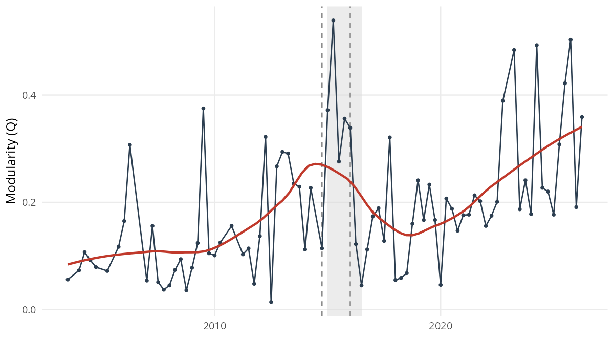
**Figure 1.** Quarterly whole-chamber modularity (Q), with a LOESS trend (red); the shaded band marks the 2015Q1–2016Q3 crisis window and the dashed lines the detected change-points (2014Q4 and the 2016Q1 impeachment). Q oscillates around the pre-2015 baseline, lifts through the window, and returns afterward (§5.1).

Raw modularity is sensitive to a network's size and density and is therefore not directly comparable across legislatures. To check that the crisis-era elevation does not merely reflect sparser networks or more lopsided votations, modularity is rescaled against a permutation null that reshuffles cast votes within each votation, preserving every vote's modal-side share and the per-deputy participation while breaking any coordination across deputies.

The agreement graph is rebuilt and re-partitioned on each of 150 draws, and $Q^*$ is the observed modularity minus the mean null modularity. The correction lowers the absolute levels but does not remove the pattern. Per-legislature $Q^*$ stays within a 0.08–0.12 band before the crisis (0.096 at the 52L, 0.079 at the 53L, 0.116 at the 54L), roughly doubles to 0.245 at the 55L, returns to 0.119 at the 56L, and rises again to 0.277 at the 57L; each value lies well above its permuted null ($z > 44$, $p < 0.001$ throughout). A $Q^*$ near zero indicates no bloc structure beyond chance; higher values mark a sharper split into voting camps. By this yardstick the crisis legislature (55L) and Lula III (57L) show the most pronounced division (the per-legislature values are tabulated in Figure 3B).
This comparison should still be read with caution, since $Q^*$ is a coarse scalar and the per-legislature networks differ in agenda and recorded-vote coverage, but on this measure the elevation at the crisis legislature is not an artifact of network size or density. The structural claim nonetheless rests on the composition and persistence of the partition (§5.6–§5.7) rather than on the height of the peak, which is itself transient. The question pursued from §5.6 onward is whether the composition of communities reorganized in a way that persisted.

## 5.2 The break is behavioral, not compositional

Restricting the within-deputy panel to reelected deputies (Table 3, Figure 2), the share whose community assignment changes is 12.7% (52L→53L), 42.2% (53L→54L), 37.7% (54L→55L), and 4.7% (55L→56L). The 54L→55L rate is an order of magnitude above the post-Bolsonaro baseline. It is not the largest of the four (the 53L→54L transition is higher), which suggests not a single 54L→55L break but a sequence that begins with the 2014 election cycle and consolidates by the 56L. Either way, the panel establishes the point H2 stakes: across the window it is the same individuals, not their replacements, who changed community. The pattern is robust across a twelve-cell grid of edge thresholds and shared-vote cutoffs (§5.8), with the 54L→55L rate staying in [29.6%, 44.8%] and never approaching 4.7%. H2 is supported: the compositional-turnover account is not what drives the result.
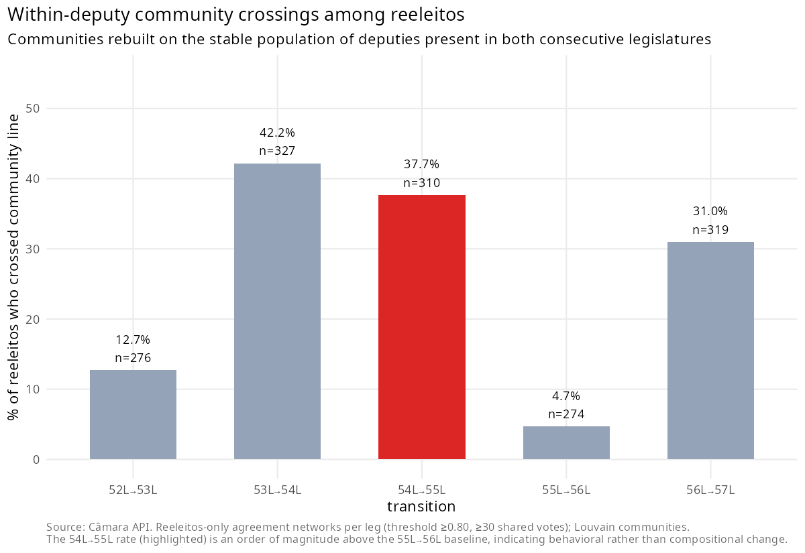
**Figure 2.** Reelected-deputy community-crossing rates across transitions (§5.2).

Following the same individuals removes the turnover explanation but does not hold their party fixed, since reelected deputies switch parties at a non-trivial rate, about 23% of them across the 54L→55L boundary once party renames and mergers are collapsed. To check that the community-crossing is not merely a by-product of those switches, the crossing is decomposed by switch status.
**Table 3. Community-crossing of reelected deputies, by transition and party-switch status (%).**

| Transition | Stayers | Switchers | Overall |
| ---------- | ------- | --------- | ------- |
| 52L→53L    | 9.1     | 31.1      | 12.7    |
| 53L→54L    | 44.3    | 29.8      | 42.2    |
| 54L→55L    | 31.9    | 56.9      | 37.7    |
| 55L→56L    | 5.0     | 3.8       | 4.7     |
| 56L→57L    | 21.0    | 51.4      | 31.0    |

"Stayers" keep the same party label across the transition; "switchers" change party (renames and mergers collapsed). The crisis-window elevation holds even among stayers, so it is not an artefact of party switching.
Among reelected deputies who stayed in the same party, the 54L→55L crossing is 31.9%, against 5.0% at the quiet 55L→56L boundary; the crisis-window crossing is thus elevated even for deputies who never changed their label, and is not reducible to party switching. Switching does add to it, since switchers cross at 56.9% at the 54L→55L boundary, which is consistent with the realignment running partly through deputies relocating toward the governing pivot.

What the panel cannot settle is the stronger claim of fixed preferences, since a deputy who keeps a party label may still have shifted position; the result establishes behavioral reorganization among persistent individuals rather than preference constancy.

## 5.3 Not chamber-presidency agenda manipulation

A second alternative is that Cunha's 2015 chamber presidency used the urgency mechanism to push bills to the floor in ways that mechanically created the apparent change. The data do not support it (Figure 3A). Dropping the ~13% of votations whose bills passed under urgência shifts the 54L→55L crossing rate by 0.1 pp. Splitting the 55L into Cunha and post-Cunha phases, modularity peaks at 0.51 during the Cunha phase, drops to 0.11 at the April-2016 impeachment vote, and stays at 0.12 after Cunha's September-2016 loss of mandate. The Q-recovery is therefore dated by the impeachment, not by Cunha's removal, which implicates the polarization episode rather than the individual. A constructed analog for Arthur Lira's 56L presidency shows no comparable spike, which does not support a generic "Centrão-leader presidency" mechanism.

## 5.4 Not fiscal-specific

H3 predicted that the coordination shift would be larger on economic-fiscal votes than on non-economic ones, the "subject-matter placebo." It is not (Appendix B). Crossing rates among reelected deputies, by domain, at 54L→55L are 36.9% on economic-fiscal votes against 39.4% on non-economic ones (Δ = −2.5 pp); separating procedural requirements from substantive non-economic votes leaves Δ = −2.6 pp. The effect is domain-agnostic, and H3 is rejected.

This rejection is robust to how procedural instruments (urgency requests and the like) are assigned a substantive domain. Re-classifying each procedural vote by the domain of the bill it targets, rather than treating procedural matters as a separate residual, leaves the 54L→55L gap between economic-fiscal and non-economic votes within a narrow band across coding schemes (|Δ| ≤ 1.9 pp); in the most complete scheme, where every resolvable procedural instrument inherits its target bill's domain, the two domains are indistinguishable (37.3% against 37.5%, Δ = −0.2 pp). Coding procedural votes by content rather than by form thus sharpens the domain-agnostic result rather than reversing it.

## 5.5 The multivariate route to EC 86 is not reliable here

The route to a multivariate-partial identification of CA 86 would be a TERGM. Two pre-tests indicate it does not offer a reliable estimate in this setting (§4, Appendix C). The implication is the one H1 anticipated as a possibility: CA 86 cannot be cleanly separated from the contemporaneous shock complex. Because the institutional shocks are collinear, the design does not estimate a marginal treatment effect; it tests whether the observed reorganization survives the main observable rival explanations. This paper therefore does not claim that EC 86 alone caused the change, nor that it had no effect. It claims that the chamber underwent a structural reorganization in which EC 86 was one component event, observable in the network at the level of community composition and reelected-deputy crossing. A cross-sectional dose-response on pre-2015 individual-amendment exposure (Appendix D), which exploits variation the temporal design cannot, is null at both the break and the post-2019 consolidation. This converges with the domain-agnostic placebo on a systemic, rather than individual-fiscal, reading.

Figure 3 gathers the falsification checks that bound this reading: the magnitude of the structural break net of a permutation null, the within-55L phase split that dates the recovery to the impeachment rather than to Cunha's removal, and the null fiscal dose-response that pulls the interpretation away from a single-lever story.

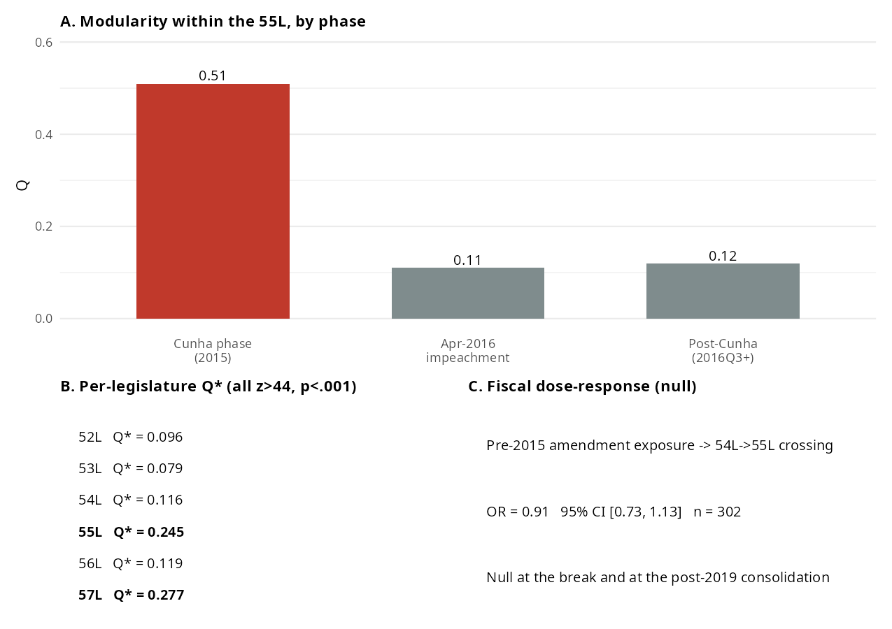
**Figure 3.** Falsification checks at a glance. A: modularity within the 55L by phase, where the Q-recovery dates from the April-2016 impeachment, not from Cunha's removal (§5.3). B: per-legislature permutation-null-corrected Q\*, sharpest at the 55L and 57L (§5.1). C: the null cross-sectional dose-response on pre-2015 amendment exposure (§5.5).

## 5.6 Community composition reorganizes and persists

Tracking how parties distribute across communities (Figure 4; the per-legislature composition heatmap is in Appendix G), the PT–PMDB–PP triad that anchored coalitional presidentialism dissolves. PT and PMDB share a community in the 52L–53L (jointly governing under Lula), diverge at the 54L (first Dilma government, post-Lava Jato), and remain split through the 56L. The PP, historically the anchor of the Centrão, tracks the PMDB after the 54L and never returns to a shared community with the PT. The pattern persists across the impeachment and the 2019 change of government. This is the durability H5 predicted: a realignment rather than a transient excursion.

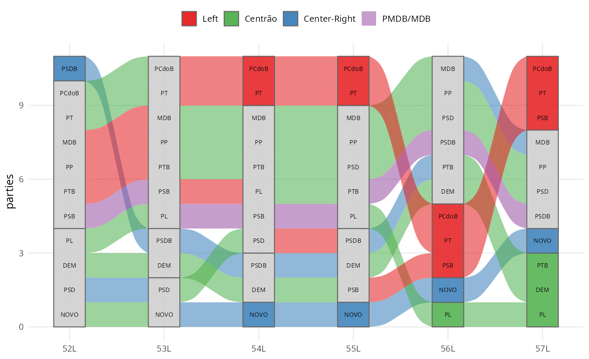
**Figure 4.** Party paths across coordinating communities, 52L–57L: the ribbons trace where blocs merge and split over time (§5.6).

## 5.7 The Centrão re-aligns with the executive core

How does the Centrão's coordination behave across the realignment: does it re-coordinate as a unit, or dissolve in each legislatura? Two metrics answer (Figure 5), both robust to the membership delimitation (§5.8). Concentration, the share of Centrão deputies in their modal community, is high before the crisis (77.7% in the 52L, 97.9% in the 53L), falls to 63.7% (54L) and 56.6% (55L), and recovers to 88.2% in the 56L. Dyad-continuity, the share of co-community reelected-deputy pairs that remain together, follows the same shape: from 99.0% (52L→53L) it collapses to 53.7% and then 50.9% across 2014–2016, then recovers to 88.8% at 55L→56L. But it recovers around a different partition, with the Centrão now tracking the MDB and detached from the PT. The high pre-crisis concentration matters in its own right: the bloc is structurally old, not a creation of the window. The bloc also grew over the period: under the dated definition, the share of the chamber sitting in Centrão parties rose from 19.5% in the 52L to 66.1% in the 57L, and the rise survives excluding the president's own PL/PSL (from 70 to 313 deputies). The pivot is therefore not only repositioned but numerically larger, consistent with a fragmentation that lacks programmatic cleavages (Zucco & Power, 2021) and with electoral coordination that multiplies mid-sized governista labels in the lower house (Limongi & Vasselai, 2018). §5.9 shows the bloc re-sorting again under Lula III; the pattern is realignment.

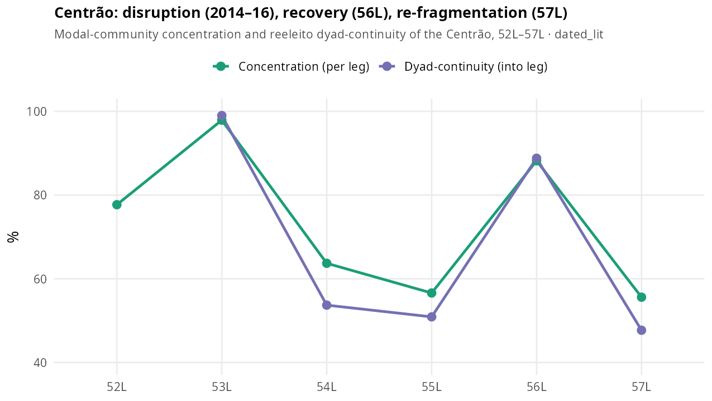
**Figure 5.** Centrão concentration (share of Centrão deputies in their modal community) and reelected-deputy dyad-continuity, dated membership scheme, 52L–57L. Both collapse across 2014–2016 and recover around a different partition, with the Centrão now tracking the MDB (§5.7, §5.9).

## 5.8 Robustness

The headline reelected deputies finding survives a twelve-cell grid of edge thresholds (0.70–0.85) and shared-vote cutoffs (20–40): the 54L→55L crossing stays in [29.6%, 44.8%]. It also survives alternative projections (Jaccard, resource-allocation) and collapses only under Newman co-participation weighting, which carries essentially no community structure (modularity ≈ 0.03–0.08). To check that the recovered structure is not an artifact of the near-unanimous votations that dominate the agreement filter, the networks were rebuilt after dropping votations whose modal side exceeded 95%, 90%, and 85% of cast votes; the 54L→55L crossing held at 30.6%, 28.6%, and 26.0% against a 55L→56L baseline of 9.5%, 7.8%, and 6.8% (Appendix F). Across four community-detection algorithms it holds on both the crossing metric and a label-matching-free ARI/NMI, with the 54L→55L crossing exceeding the 55L→56L baseline by 20–33 points under all four and Louvain and Leiden interchangeable (ARI ≈ 0.98–1.00). The Centrão concentration/continuity trajectory survives six membership schemes, including the narrowest survey-based core, and proper dating strengthens the pre-crisis antiquity rather than weakening it (Appendix E).

Three further checks stress the panel beyond that grid. First, a nonparametric bootstrap that resamples the votations within each legislature (60 draws) puts the 54L→55L crossing at 36.6% with a 95% interval of [32.0%, 42.5%], against 6.0% [3.6%, 11.1%] for the quiet 55L→56L; the intervals do not overlap, and the crisis transition exceeds the quiet one in every draw. Second, replacing the greedy community-matching with a one-to-one assignment leaves both rates unchanged (38.4% and 4.7%). Third, varying the Louvain resolution narrows the gap, and the greedy crossing rate even reverses at fine resolution (γ ≥ 1.3). That reversal is driven primarily by asymmetric overfragmentation and label matching, so the crossing rate ceases to be interpretable at that scale. Fine resolution does genuinely alter the partitions, since the adjusted Rand index across the quiet transition also falls, from 0.42 at the default resolution to 0.28 at γ = 1.3. The label-free ARI and NMI nevertheless preserve the relative contrast between transitions, with the crisis transition always the less similar of the two (ARI 0.22 against 0.42 at the default resolution, and 0.23 against 0.28 at γ = 1.3). The crossing rate is therefore read alongside ARI and NMI, which carry the contrast at every resolution rather than at the default alone.

The threshold, weighting, algorithm, and Centrão-classification robustness panels are collected in Appendix F.

## 5.9 The 57th legislature: the pivot follows the executive

Extending the pipeline to the 57L (Lula III) supplies a fifth transition and tests whether the post-2016 structure is a frozen institution or a re-coordinating pivot. It is the latter. The reelected-deputy crossing at the 56L→57L boundary is 31.0%, comparable to the crisis transitions and an order of magnitude above the quiet 55L→56L (4.7%), and it is robust to down-sampling the 56L to the 57L vote count. Centrão dyad-continuity collapses from 88.8% back to 47.7%, and the PT–MDB axis does not re-form (Figures 5–6).

A pivotality test (Table 4) makes the pattern explicit and bears most directly on H4. For each legislatura the test asks which parties sit in the largest coordinating community, the bloc that tends to anchor the working majority. The Centrão sits there in every legislatura. The PT does so only while it dominates the executive (Lula I–II); from the first Dilma government onward it forms a distinct, cohesive minority cluster. It does so even under Lula III, when the PT again holds the presidency yet its own party is absent from the chamber's largest coordinating bloc while the Centrão is present. The pivot sits in the largest coordinating community whoever wins; the programmatic governing party does not. This is the positional, asymmetric pattern H4 anticipated.

**Table 4. Share of each party's deputies in the chamber's largest coordinating community (%), by legislature.**

| Legislature | Centrão | MDB  | PT   | PSOL | NOVO |
| ----------- | ------- | ---- | ---- | ---- | ---- |
| 52L         | 77.7    | 63.0 | 88.5 | —    | —    |
| 53L         | 97.9    | 95.3 | 100  | 0    | —    |
| 54L         | 63.2    | 87.9 | 0    | 0    | —    |
| 55L         | 56.6    | 77.3 | 0    | 0    | —    |
| 56L         | 88.7    | 94.9 | 0    | 0    | 0    |
| 57L         | 55.6    | 75.0 | 0    | 0    | 0    |

Dashes mark legislatures in which a party held no seats. The Centrão and the MDB are in the largest community throughout; the PT only while it governs (52L–53L).

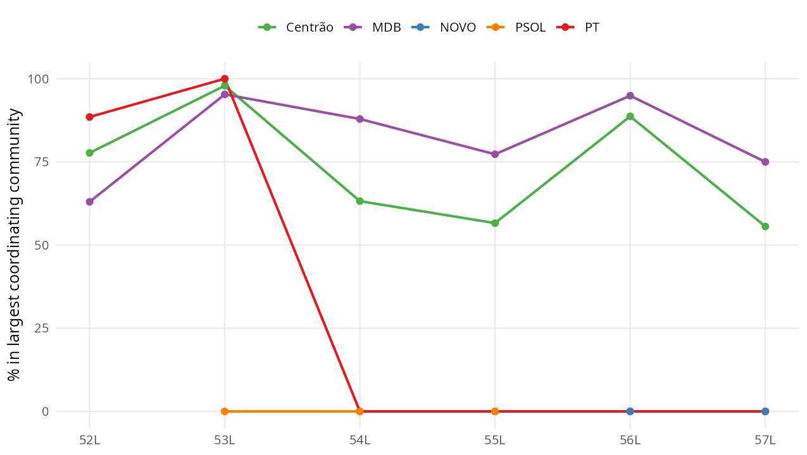
**Figure 6.** Share of each party's deputies in the chamber's largest coordinating community, 52L–57L. The Centrão and the MDB sit there throughout; the PT only while it governs (52L–53L), and not even under Lula III (§5.9). The same data as a per-legislature heatmap are in Appendix G.

## 5.10 The Centrão's decision weight

Pivotality establishes position. A distinct question is weight: whether the winning side wins because of the Centrão. Sartori (1976) separates exactly these two, the "coalition potential" needed to assemble majorities from the "blackmail potential" that can extract a price. This subsection measures the first; §6 reads the second from the institutional record. The two are independent, since a bloc can be reliably aligned yet never decisive. The counterfactual is mechanical: a roll-call counts as one the bloc decides when removing its votes, without reassigning them, flips the simple Yes–No majority, and "competitive" restricts the count to roll-calls on which the losing side is at least one-third of the valid votes. The largest coordinating community is read as the working-majority bloc, a reading the pivotality count tests rather than assumes.

That reading can also be checked directly against outcomes. On competitive roll-calls, the share on which the largest coordinating community votes with the winning side is 76.3% (53L), 83.6% (54L), 82.2% (55L), 89.0% (56L), and 95.9% (57L). The alignment stays high even where that community is a numerical minority of the chamber, as in the 54L, 55L, and 57L, so it is not simply a mechanical consequence of bloc size, though that qualification does apply in the legislatures where the community is large (about three-quarters of the chamber in the 53L, two-thirds in the 56L). Winning, however, is not the same as following the executive. The share on which the same bloc follows the government's declared voting orientation falls to 48.8% in the 54L, the crisis legislature, against 77% to 92% on either side of it, and it is lower under Lula III (76.2%) than under Bolsonaro (92.4%). The bloc that anchors the winning majority thus decoupled from the Executive at the break, which is consistent with the positional, government-of-the-day reading rather than with steady governismo.

What this weight reveals is a migration of the decisive core, not a Centrão that was always decisive. On competitive roll-calls, the bloc whose removal would flip the winner is the president's own party while it governs (the PT is pivotal on 33.3% of contested votes in the 52L and 30.9% in the 54L, against 20.8% and 16.4% for the Centrão), and it is the Centrão afterward, whose strict-flip decisiveness rises to 31.9% (55L) and 53.6% under Bolsonaro (56L, net of the president's party), while the PT falls to 5.3% once in opposition (Figure 7). The decisive core thus passes from the programmatic governing party to the non-programmatic pivot across the break. Two cautions bound the claim. First, flip-decisiveness rises partly because the pivot itself grew: holding the bloc at its 52L size by resampling does not reproduce the increase, so the structural reading rests on the size-invariant pivotality of §5.9 (which community a bloc occupies) rather than on the decisiveness magnitude. Second, across all decided votes the level is far lower (about 12% under Bolsonaro), since most roll-calls are lopsided and resolve the same way with or without any one bloc; the contrast with the poles, not the absolute level, is the point. The executive-leverage face of this weight, its decisiveness on the president's own legislative agenda and the cabinet allocation that mirrors it, is size-sensitive and is developed in a companion analysis.

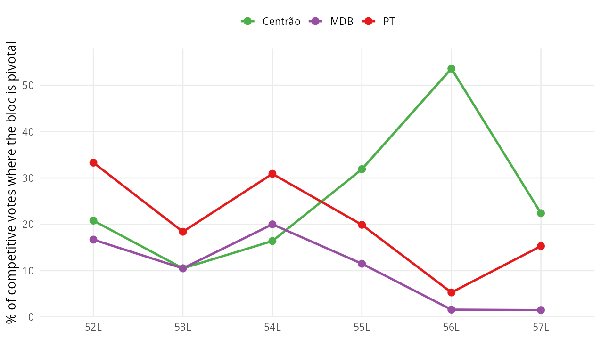
**Figure 7.** Vote-level decisiveness on competitive roll-calls, net of the president's party: Centrão vs PT vs MDB, 52L–57L. The decisive core migrates from the PT (while it governs) to the Centrão after the break (§5.10).

**Outcome of each hypothesis.**

|        | Test       | Key evidence                                                                                                                                                                                                                                                                                        | Verdict                                                                      |
| ------ | ---------- | --------------------------------------------------------------------------------------------------------------------------------------------------------------------------------------------------------------------------------------------------------------------------------------------------- | ---------------------------------------------------------------------------- |
| **H1** | §5.1, §5.5 | The break is localized to 2014–2016, but EC 86 is collinear with the shock complex and a TERGM does not reliably estimate it here.                                                                                                                                                                                      | Not identified separately from the contemporaneous shocks; motivates the eliminative design |
| **H2** | §5.2       | Reelected-deputy community-crossing of 37.7% at 54L→55L against 4.7% at 55L→56L; robust across twelve specifications.                                                                                                                                                                               | **Supported**                                                                |
| **H3** | §5.4       | Crossing by domain at 54L→55L is 36.9% economic-fiscal against 39.4% non-economic (Δ = −2.5 pp).                                                                                                                                                                                                    | **Rejected**: the disruption is domain-agnostic                              |
| **H4** | §5.9–§5.10 | The Centrão sits in the largest coordinating community under every government, the president's party only when it governs; net of the president's party, decisive on 53.6% of competitive roll-calls under Bolsonaro, with the decisive core migrating from the PT to the Centrão across the break. | **Supported**                                                                |
| **H5** | §5.6–§5.7  | The PT–PMDB community does not re-form; the recomposed structure holds across the impeachment and the 2019 change of government.                                                                                                                                                                    | **Supported**                                                                |

---

# 6. Discussion

## 6.1 What the analysis found

The chamber underwent a coordinative reorganization observable at the bipartite-network level, localized in 2014–2016, and not reducible to compositional turnover, agenda manipulation, or a fiscal channel (§5.1–§5.5). In the terms of §2, H2, H4, and H5 are supported; H3, the fiscal-channel prior, is rejected; and H1, the marginal effect of EC 86, is unidentifiable rather than disproved. What the network shows is not a chamber that polarized in the coalition-gap sense, since that gap is stable across the break, but one whose community partition was redrawn around its pragmatic center. The PT–PMDB shared community dissolves at the 54L and does not re-form, while the Centrão detaches from the PT and re-coordinates around the MDB, then the Bolsonaro government, then re-sorts again under Lula III (§5.6–§5.7, §5.9). The pivotality test points the same way: the Centrão sits in the largest coordinating community under every government, the president's programmatic party only when it dominates the executive, and not even then under Lula III. EC 86 is one component of the shock complex that opened this realignment, not an isolable cause.

## 6.2 Governing through the pivot: polarization without paralysis

This reframes a puzzle the polarization literature usually leaves unresolved. Across the period the party system polarized and the ideological center was vacated (Zucco & Power, 2021), and standard accounts expect gridlock or instability. Recent accounts of the same period converge on the observation that the chamber absorbed budgetary and agenda powers yet did not lapse into decisional paralysis, even as governing came to rest on an unstable, case-by-case base (Couto & Abrucio, 2026; Couto et al., 2025). Brazil became governable through a different channel. With the center emptied of program, majorities came to rest less on programmatic coalition-building and more on the price of a non-ideological pivot available to any executive (Strøm, 1990; Pedersen, 2012; Desposato, 2006). The mechanism is one of scarcity. Polarization locks the poles, the supply of movable votes collapses to the pragmatic center, and the bloc holding the only movable votes commands a rising price. This is Sartori's blackmail potential operating as a rent of scarcity, with the bloc's low programmatic visibility the very thing that keeps it available. What the network adds is the measure. It shows who re-aligned and when, and, through §5.10, that the center, net of the president's own party, is not merely present at majorities but increasingly supplies the marginal one on the competitive votes (decisive on a majority of them under Bolsonaro). The budget price, the RP-9 "secret budget" used from 2020 and struck down in 2022, is read here from the institutional record.

Two readings of the same period need not conflict. Polarization indices and ideal-point scaling describe hardening poles; the coordination network describes recomposing blocs. Both hold at once: across the window the coalition gap widens as the poles harden, while the same deputies cross community lines as the blocs recompose. The first process is what axial methods record; the second is what they suppress by construction, and recovering it is the empirical contribution here.

## 6.3 From agent to principal, and the comparative pattern

The deeper claim concerns the direction in which the pivot operates, and it is the interpretive thesis of this section rather than a tested hypothesis. The pragmatic center is not new: its governismo is traceable to the First and Second Republics (Desposato, 2006), and the Centrão label to 1987 (Munhoz, 2011). What changes is the side of the principal–agent relation it occupies. Under the canonical settlement the pivot was an agent, disciplined by the executive with pork and posts in return for a majority (Figueiredo & Limongi, 2000). The post-2014 transfers of budgetary control, namely mandatory amendments, the rapporteur-controlled secret budget, and an autonomous chamber presidency, reverse that relation. The pivot ceases to sell governability on the executive's terms and begins to set them, the configuration recent scholarship calls governo congressual (Couto, 2025). What this paper adds is to render the inversion as a measured, dated phase transition. On the vote side it appears as positional pivotality and rising decision weight among the competitive votes (§5.9–§5.10); the office side, the post-2015 flip in cabinet allocation from the president's own camp to the pivot, is taken up in a companion analysis on executive leverage.

Comparatively, the case is best read not against the typology of party-system change, since it is not collapse, hyper-fragmentation, programmatic realignment, or stable institutionalization, but against a recurring and under-measured type, the permanent governing pivot. A non-programmatic bloc that joins whatever coalition governs, in exchange for office and budget, and is thereby insulated from electoral alternation, recurs across systems: Israel's ultra-Orthodox parties in Likud- and Labor-led coalitions alike, and Italy's Christian Democracy as the indispensable centre from 1946 to 1994. The Centrão is the Brazilian member of this family, differing in being a multi-party bloc. These cases are not homologues of the Brazilian Centrão; they mark a broader family of low-programmatic pivots whose availability across governments insulates them from alternation. They appear to share a configuration rather than a mere resemblance: low programmatic anchoring, availability to any governing coalition, and, in consequence, some insulation from electoral alternation. Where that configuration holds, and the scope conditions below try to specify where, polarization may raise the pivot's value rather than erode it, and a system may reorganize its coordination without the changes the typologies usually track. This is offered as a conjecture the design can inform, not as an established regularity. The mechanism that makes such blocs durable, namely that low programmatic anchoring eases repositioning, echoes the one Levitsky (2003) identifies for Argentine Peronism, transferred as a mechanism rather than as a direct homologue. It connects in turn to the cartel-party thesis (Katz & Mair, 1995, 2009), and the democratic consequence is the one Mair identified: a bloc that governs without being held to account, because the programmatic invisibility that keeps it available also shields it from retrospective sanction (Przeworski et al., 1999). The claim itself is old; what this paper adds is more modest, a way of looking. The Israeli and Italian pivots are known mainly from the historical record, which does not readily show whether the bloc occupies the coordinating core, or when it moves, since those cases were not read from the vote structure. The pivotality and decision-weight measures offer one way to recover that, and they should carry over to other fragmented chambers with recorded votes.

The mechanism should travel to settings that share four features: a fragmented multiparty legislature; an executive dependent on a multiparty majority; pragmatic parties of low programmatic anchoring; and distributive resources or a legislative agenda that are negotiable. Where these hold, polarization should concentrate the movable votes on a non-programmatic pivot rather than produce gridlock. Read against the standard menu of party-system change, the case occupies a cell those categories leave empty (Table 5).

**Table 5. Modes of party-system change and the Brazilian case.**

| Mode of change                               | What changes                                            | The Brazilian case                                  |
| -------------------------------------------- | ------------------------------------------------------- | --------------------------------------------------- |
| Collapse                                     | Parties and voter–party linkages disappear              | Does not occur                                      |
| Hyper-fragmentation                          | Effective number of parties rises                       | Occurs, but does not explain the coordination shift |
| Programmatic realignment                     | The ideological axis recomposes                         | Not the main process                                |
| (De)institutionalization                     | Stability of party linkages changes                     | Partial, insufficient                               |
| Coordination reorganization without collapse | Legislative communities and the pivot's position change | The central mechanism                               |

## 6.4 Methodological contribution and limits

Methodologically, this paper shows that bipartite community detection, coupled with an eliminative falsification design, recovers institutional reorganization that single-dimensional scaling suppresses by construction, and it provides the first longitudinal, network-based measurement of a governista pivot's position. The falsification chain (compositional turnover, Cunha-era urgency, the subject-matter placebo, and a multivariate model that does not estimate reliably at this scale) is reusable wherever a multivariate-partial design is unavailable.

The limits are real. This study cannot isolate CA 86's marginal contribution; the subject-matter placebo's null forces a systemic rather than sectoral reading; what the network measures is the pivot's coordinative position, while the budget price is attributed to the institutional record; the human validation of the issue-domain classification (n = 294; α = 0.84) confirms it while leaving residual borderline cases, though the only result depending on it is a null; the nominal agenda is not a random sample of chamber activity, and its composition shifts over the period, with more contested votes and fewer of executive origin, so part of what the network registers may reflect which matters reach a recorded vote, a selection the within-deputy panel only partly absorbs; the 57L is partial and ongoing; and plenary roll-calls are only a partial trace of coordination. The 2014–2016 window has the formal profile of a critical juncture (Capoccia & Kelemen, 2007). This paper notes the resemblance but does not adopt that lens, since doing so would require a counterfactual reconstruction of foreclosed paths that the network evidence does not speak to. What this paper claims is narrower, and the falsification chain supports it under the tests implemented: the reorganization occurred, persisted, and is not reducible to the alternatives tested in §5.

The selection of recorded votes, the standard objection to roll-call analysis (Carrubba et al., 2008), is treated where the object is defined (§3). In brief: because the estimand is the observed architecture of coordination on the decisions that reached the floor, not a latent ideal-point space, the leader-structured recorded agenda is the relevant universe rather than a biased sample of it; the within-deputy panel and the urgency, domain, and near-unanimous checks further bound the threat. The structural endogeneity of what becomes a recorded vote nonetheless remains a limitation rather than something resolved.

---

# 7. Conclusion

The Brazilian Chamber of Deputies reorganized the way it coordinates votes in the 2014–2016 window. The change is observable at the bipartite-network level, it is not reducible to the compositional, agenda-manipulation, or fiscal-channel alternatives that could be tested directly, and it persists through the 2019 change of government and beyond. The architecture that had organized cross-party coordination, anchored on a PT–PMDB governing community and the executive's capacity to discipline the pragmatic center through discretionary budget release, gave way to one in which that center, the Centrão, detaches from the executive's bloc and re-coordinates around whichever government holds power. The Limongi and Figueiredo (1995) finding of disciplined parties survives at the party level; the characterization of executive-led inter-party coordination does not.

The substantive contribution is to characterize, and to measure, what that change was. The Centrão is not a creation of the crisis. It is a long-standing governista pivot whose position relative to the executive shifted, from a disciplined agent of the presidency to an autonomous bloc the government must court, and one that, net of the president's own party, is decisive in supplying the marginal majority on the contested votes. A pivotality test states the pattern at its sharpest: across six legislatures the Centrão sits in the chamber's largest coordinating community under every government, while the president's programmatic party does so only when it dominates the executive, and not even then under Lula III. The chamber coordinates by position relative to power rather than by a fixed ideological axis, and this is what keeps a polarizing party system governable, since a non-ideological pivot whose support can be negotiated supplies the marginal majority the polarized poles cannot. Against the comparative typology, the case is a positional realignment the existing categories do not isolate.

The methodological contribution is the design itself. Where the marginal effect of a single institutional shock cannot be identified, because it is collinear with co-occurring events and a multivariate network model does not estimate reliably at this scale, an eliminative chain of falsifications anchored on within-deputy panels and a longitudinal community-detection apparatus remains a defensible inferential path, one that recovers structure single-dimensional scaling suppresses by construction. Three lines of work follow. The first is extending the panel through the rest of the 57L and into the 58L, to see whether the pivot's re-sorting settles or recurs. The second is overlaying plenary speeches on the same network for an independent test at the individual level. The third is porting the design to other fragmented chambers, the Chilean, Peruvian, and Argentine cases among them, where the standard multivariate tools are unavailable. The broader lesson is that party systems can preserve their organizational units while reorganizing the architecture through which legislative majorities are assembled, a change the standard typologies of collapse and realignment do not register. Across 2014–2026, the Brazilian Chamber did not collapse; it reorganized around a governista pivot that continues to re-sort with the government of the day.

---

# References

> 72 works cited. Reference style: APA 7th edition (Comparative Political Studies).

- Abranches, S. H. H. (1988). Presidencialismo de coalizão: O dilema institucional brasileiro. *Dados*, *31*(1), 5–34.
- Abranches, S. H. H. (2018). *Presidencialismo de coalizão: Raízes e evolução do modelo político brasileiro*. Companhia das Letras.
- Almeida, A. (2025). *Revertendo a delegação: O crescente protagonismo legislativo do Congresso Nacional* (Texto para Discussão No. 3163). Instituto de Pesquisa Econômica Aplicada. https://doi.org/10.38116/td3163-port
- Alston, L. J., & Mueller, B. (2006). Pork for policy: Executive and legislative exchange in Brazil. *Journal of Law, Economics, and Organization*, *22*(1), 87–114.
- Ames, B. (1995). Electoral rules, constituency pressures, and pork barrel: Bases of voting in the Brazilian Congress. *The Journal of Politics*, *57*(2), 324–343.
- Amorim Neto, O., Cox, G. W., & McCubbins, M. D. (2003). Agenda power in Brazil's Câmara dos Deputados, 1989–98. *World Politics*, *55*(4), 550–578.
- Baumgartner, F. R., & Jones, B. D. (1993). *Agendas and instability in American politics*. University of Chicago Press.
- Bertholini, F., & Pereira, C. (2017). Pagando o preço de governar: Custos de gerência de coalizão no presidencialismo brasileiro. *Revista de Administração Pública*, *51*(4), 528–550.
- Blondel, V. D., Guillaume, J.-L., Lambiotte, R., & Lefebvre, E. (2008). Fast unfolding of communities in large networks. *Journal of Statistical Mechanics: Theory and Experiment*, *2008*(10), P10008.
- Bolognesi, B., Ribeiro, E., & Codato, A. (2023). A new ideological classification of Brazilian political parties. *Dados*, *66*(2), e20210164.
- Borgatti, S. P., & Everett, M. G. (1997). Network analysis of 2-mode data. *Social Networks*, *19*(3), 243–269.
- Bowler, S., Farrell, D. M., & Katz, R. S. (1999). *Party discipline and parliamentary government*. Ohio State University Press.
- Brito, A. C. M., Silva, T. C., & Amancio, D. R. (2020). Modeling Brazilian Congress: A network analysis of the Chamber of Deputies. *PLOS ONE*, *15*(12), e0244211.
- Capoccia, G., & Kelemen, R. D. (2007). The study of critical junctures: Theory, narrative, and counterfactuals in historical institutionalism. *World Politics*, *59*(3), 341–369.
- Carrubba, C. J., Gabel, M., & Hug, S. (2008). Legislative voting behavior, seen and unseen: A theory of roll-call vote selection. *Legislative Studies Quarterly*, *33*(4), 543–572.
- Clinton, J., Jackman, S., & Rivers, D. (2004). The statistical analysis of roll call data. *American Political Science Review*, *98*(2), 355–370.
- Couto, C. G. (2025). Lula 3: Presidencialismo de coalizão em tempos de governo congressual. In F. Kerche & M. Marona (Eds.), *Governo Lula 3: Reconstrução democrática e impasses políticos* (pp. 37–51). Autêntica.
- Couto, C. G., & Abrucio, F. L. (2026). Equilíbrios instáveis e policêntricos: O atual presidencialismo brasileiro. In Gomide, Marenco, & Oliveira (Eds.), *Reformar o Estado: O que fazer?* (pp. 16–33). Jacarta; Enap.
- Couto, C. G., Arantes, R. B., & Abrucio, F. L. (2025). Transformação e resiliência institucional na democracia brasileira (2012–2025): Polity, politics e policy em interação. *Revista de Sociologia e Política*, *33*, e010.
- Cox, G. W., & McCubbins, M. D. (2005). *Setting the agenda: Responsible party government in the U.S. House of Representatives*. Cambridge University Press.
- Cranmer, S. J., & Desmarais, B. A. (2011). Inferential network analysis with exponential random graph models. *Political Analysis*, *19*(1), 66–86.
- Desposato, S. W. (2006). The impact of electoral rules on legislative parties: Lessons from the Brazilian Senate and Chamber of Deputies. *Journal of Politics*, *68*(4), 1018–1030.
- Erdman, C., & Emerson, J. W. (2007). bcp: An R package for performing a Bayesian analysis of change point problems. *Journal of Statistical Software*, *23*(3), 1–13.
- Figueiredo, A. C., & Limongi, F. (1995). Partidos políticos na Câmara dos Deputados, 1989–1994. *Dados*, *38*(3), 497–525.
- Figueiredo, A. C., & Limongi, F. (1999). *Executivo e Legislativo na nova ordem constitucional*. FGV/FAPESP.
- Figueiredo, A. C., & Limongi, F. (2000). Presidential power, legislative organization, and party behavior in Brazil. *Comparative Politics*, *32*(2), 151–170.
- Fowler, J. H. (2006). Connecting the Congress: A study of cosponsorship networks. *Political Analysis*, *14*(4), 456–487.
- Gatto, M. A. C., & Power, T. J. (2016). Postmaterialism and political elites: The value priorities of Brazilian legislators. *Journal of Politics in Latin America*, *8*(1), 33–68.
- Goodreau, S. M., Handcock, M. S., Hunter, D. R., Butts, C. T., & Morris, M. (2008). A statnet tutorial. *Journal of Statistical Software*, *24*(9), 1–26.
- Guimarães, A., Perlin, G., & Maia, L. (2019). Do presidencialismo de coalizão ao parlamentarismo de ocasião: Análise das relações entre Executivo e Legislativo no governo Dilma Rousseff. In G. Perlin & M. Santos (Eds.), *Presidencialismo de coalizão em movimento* (pp. 25–59). Edições Câmara.
- Handcock, M. S. (2003). *Assessing degeneracy in statistical models of social networks* (Working Paper No. 39). Center for Statistics and the Social Sciences, University of Washington.
- Imai, K., Lo, J., & Olmsted, J. (2016). Fast estimation of ideal points with massive data. *American Political Science Review*, *110*(4), 631–656.
- Katz, R. S., & Mair, P. (1995). Changing models of party organization and party democracy: The emergence of the cartel party. *Party Politics*, *1*(1), 5–28.
- Katz, R. S., & Mair, P. (2009). The cartel party thesis: A restatement. *Perspectives on Politics*, *7*(4), 753–766.
- Killick, R., Fearnhead, P., & Eckley, I. A. (2012). Optimal detection of changepoints with a linear computational cost. *Journal of the American Statistical Association*, *107*(500), 1590–1598.
- Knill, C. (2013). The study of morality policy: Analytical implications from a public policy perspective. *Journal of European Public Policy*, *20*(3), 309–317.
- Krehbiel, K. (1993). Where's the party? *British Journal of Political Science*, *23*(2), 235–266.
- Latapy, M., Magnien, C., & Del Vecchio, N. (2008). Basic notions for the analysis of large affiliation networks / bipartite graphs. *Social Networks*, *30*(1), 31–48.
- Leifeld, P., Cranmer, S. J., & Desmarais, B. A. (2018). Temporal exponential random graph models with btergm: Estimation and bootstrap confidence intervals. *Journal of Statistical Software*, *83*(6).
- Levitsky, S. (2003). *Transforming labor-based parties in Latin America: Argentine Peronism in comparative perspective*. Cambridge University Press.
- Levitsky, S., & Loxton, J. (2013). Populism and competitive authoritarianism in the Andes. *Democratization*, *20*(1), 107–136.
- Limongi, F., & Vasselai, F. (2018). Entries and withdrawals: Electoral coordination across different offices and the Brazilian party systems. *Brazilian Political Science Review*, *12*(3), e0006.
- Lupu, N. (2014). Brand dilution and the breakdown of political parties in Latin America. *World Politics*, *66*(4), 561–602.
- Mainwaring, S. (Ed.). (2018). *Party systems in Latin America: Institutionalization, decay, and collapse*. Cambridge University Press.
- Mainwaring, S., & Bizzarro, F. (2018). The fates of third-wave democracies. In S. Mainwaring (Ed.), *Party systems in Latin America: Institutionalization, decay, and collapse* (pp. 1–40). Cambridge University Press.
- Mainwaring, S., & Pérez-Liñán, A. (1998). Disciplina partidária: O caso da Constituinte. *Lua Nova*, (44), 107–136.
- Mainwaring, S., & Scully, T. R. (1995). *Building democratic institutions: Party systems in Latin America*. Stanford University Press.
- Mooney, C. Z. (1999). The politics of morality policy: Symposium editor's introduction. *Policy Studies Journal*, *27*(4), 675–680.
- Munhoz, S. R. (2011). A atuação do "Centrão" na Assembleia Nacional Constituinte de 1987/1988: Dilemas e contradições. *Revista Política Hoje*, *20*(1), 343–394.
- Newman, M. E. J. (2001). Scientific collaboration networks: I. Network construction and fundamental results. *Physical Review E*, *64*(1), 016131.
- Pedersen, H. H. (2012). What do parties want? Policy versus office. *West European Politics*, *35*(4), 896–910.
- Peixoto, T. P. (2014). Hierarchical block structures and high-resolution model selection in large networks. *Physical Review X*, *4*(1), 011047.
- Pereira, C., & Mueller, B. (2002). Comportamento estratégico em presidencialismo de coalizão. *Dados*, *45*(2), 265–301.
- Pereira, C., & Mueller, B. (2004). The cost of governing: Strategic behavior of the president and legislators in Brazil's budgetary process. *Comparative Political Studies*, *37*(7), 781–815.
- Perlin, G., & Santos, M. (2019). Introdução. In G. Perlin & M. Santos (Eds.), *Presidencialismo de coalizão em movimento* (pp. 13–21). Edições Câmara.
- Pierson, P. (2004). *Politics in time: History, institutions, and social analysis*. Princeton University Press.
- Poole, K. T., & Rosenthal, H. (1997). *Congress: A political-economic history of roll call voting*. Oxford University Press.
- Power, T. J., & Rodrigues-Silveira, R. (2019). Mapping ideological preferences in Brazilian elections, 1994–2018: A municipal-level study. *Brazilian Political Science Review*, *13*(1), e0001.
- Power, T. J., & Zucco, C. (2009). Estimating ideology of Brazilian legislative parties, 1990–2005: A research communication. *Latin American Research Review*, *44*(1), 218–246.
- Przeworski, A., Stokes, S. C., & Manin, B. (Eds.). (1999). *Democracy, accountability, and representation*. Cambridge University Press.
- Raile, E. D., Pereira, C., & Power, T. J. (2011). The executive toolbox: Building legislative support in a multiparty presidential regime. *Political Research Quarterly*, *64*(2), 323–334.
- Roberts, M. E., Stewart, B. M., Tingley, D., Lucas, C., Leder-Luis, J., Gadarian, S. K., Albertson, B., & Rand, D. G. (2014). Structural topic models for open-ended survey responses. *American Journal of Political Science*, *58*(4), 1064–1082.
- Sartori, G. (1976). *Parties and party systems: A framework for analysis*. Cambridge University Press.
- Schweinberger, M. (2011). Instability, sensitivity, and degeneracy of discrete exponential families. *Journal of the American Statistical Association*, *106*(496), 1361–1370.
- Simoni Jr., S., Madeira, R., & Piazza, M. A. (2026). Políticas de combate à pobreza em tempos de crise e polarização: Posicionamentos dos deputados federais brasileiros sobre o Benefício de Prestação Continuada (2011–2022). In Gomide, Marenco, & Oliveira (Eds.), *Reformar o Estado: O que fazer?* (pp. 71–87). Jacarta; Enap.
- Snijders, T. A. B. (2017). Stochastic actor-oriented models for network dynamics. *Annual Review of Statistics and Its Application*, *4*, 343–363.
- Strøm, K. (1990). A behavioral theory of competitive political parties. *American Journal of Political Science*, *34*(2), 565–598.
- Tarouco, G. S., & Madeira, R. M. (2013). Programs and parties: Rethinking electoral competition in Brazil. *Brazilian Political Science Review*, *7*(1), 58–82.
- Testa, G., Mesquita, L., & Bolognesi, B. (2024). Do fisiologismo ao centro do poder: As reformas eleitorais e o centrão 2.0. *Caderno CRH*, *37*, e024003.
- Zucco, C. (2009). Ideology or what? Legislative behavior in multiparty presidential settings. *Journal of Politics*, *71*(3), 1076–1092.
- Zucco, C., & Lauderdale, B. E. (2011). Distinguishing between influences on Brazilian legislative behavior. *Legislative Studies Quarterly*, *36*(3), 363–396.
- Zucco, C., & Power, T. J. (2021). Fragmentation without cleavages? Endogenous fractionalization in the Brazilian party system. *Comparative Politics*, *53*(3), 477–500.

---

# Appendices — Legislative Coordination and Institutional Change

> Companion appendices to the short paper. Consolidated for completeness and to gauge length for
> journal submission. Cross-referenced from the main text (§3, §4, §5).

---

## Appendix A — Data and coverage

The analysis spans the 52nd–57th legislatures (February 2003 to mid-2026). All plenary votations
(`siglaOrgao  "PLEN"`) and individual deputies' votes are retrieved from the Câmara open-data API.
The nominal-recorded share — the fraction of votations registering each deputy's individual choice —
rises over time with the digitization of chamber procedure:

| Legislature | Nominal-recorded share |
|---|---|
| 52L | 5.9% |
| 53L | ~12% |
| 54L | ~12% |
| 55L | ~13% |
| 56L | 39.0% |

The number of unique deputies per legislature exceeds the 513 statutory seats because of *suplentes*
(mid-term substitutes). A behavioral check indicates their party loyalty is indistinguishable from
that of full-term members, so the inflation does not distort the community structure. The bill
reference is populated by the API for only 10.4% of nominal votations; the vote identifier encodes
the bill prefix, and parsing it recovers the reference for all 3,646 nominal votations, expanding
the underlying universe from 373 to 1,259 bills.

---

## Appendix B — Issue-domain classification and validation

**Codebook.** Each bill is classified into one of three substantive domains — economic-fiscal,
rights/moral-regulation, or residual ("other") — on the axis of conflict rather than the surface
topic: a matter is economic-fiscal when the executive's distributive resources could plausibly
change the vote, and moral when the division rests on values those resources do not reach. The
primary classifier is rule-based (bill type plus a curated dictionary); a local LLM pass
(Qwen 2.5 32B via Ollama; temperature 0, seed 2026) on the bill text serves as an independent
cross-check.

**Procedural instruments.** Procedural instruments (urgency requests and the like) are classified
by the domain of the proposition they target — the underlying bill resolved from the structured
vote record (`proposicoesAfetadas`) where available, and from the instrument's text otherwise —
following standard practice in policy-agenda coding (Baumgartner and Jones 1993). Where the
instrument's own text is itself substantive (e.g., a referendum bill), that classification
prevails. Coding procedural votes by content rather than by form raises agreement on those
instruments from 47% to 73%.

**Human validation (n = 294).** A hand-coded gold standard yields, against the content-based
classification:

| Metric | Value |
|---|---|
| Agreement (accuracy) | 89.5% |
| Cohen's κ | 0.837 |
| Krippendorff's α (nominal) | 0.837 |
| Macro-F1 | 0.882 |

Per category (precision / recall / F1): economic-fiscal 0.93 / 0.95 / 0.94; rights-moral
0.99 / 0.84 / 0.91; other 0.74 / 0.88 / 0.81. Both reliability coefficients clear the conventional
0.80 threshold. Coding procedural instruments by content rather than form raises α from 0.758 to
0.837. Residual disagreement is concentrated in genuinely borderline domain calls, not in the
procedural rule.

**Sensitivity of H3 to procedural coding.** The §5.4 null is robust to how procedural votes are
assigned a domain. The 54L→55L gap between economic-fiscal and non-economic crossing stays within
a narrow band across coding schemes (|Δ| ≤ 1.9 pp); in the most complete scheme, where every
resolvable procedural instrument inherits its target bill's domain, the two domains are
indistinguishable (37.3% vs 37.5%, Δ = −0.2 pp). Coding by content sharpens the domain-agnostic
result rather than reversing it.

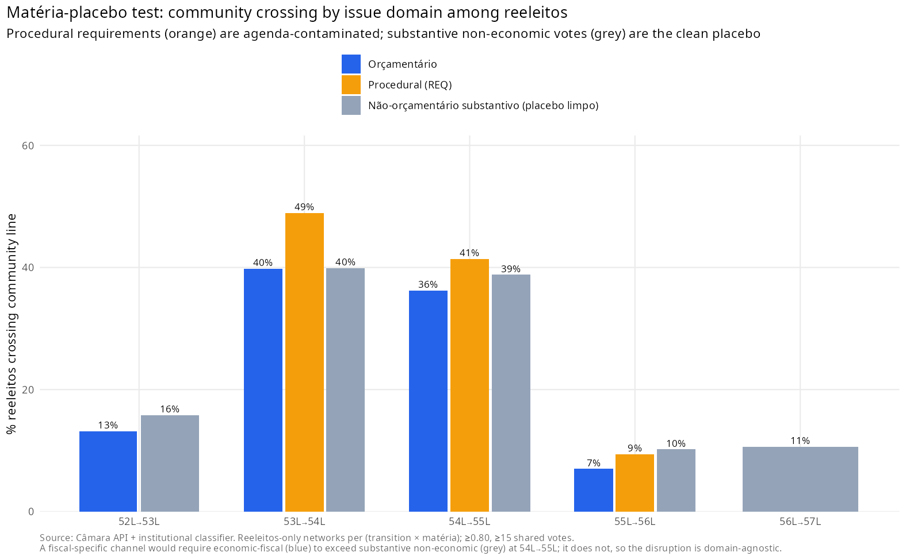
**Figure B1.** Subject-matter placebo: reelected-deputy crossing at the 54L→55L break, economic-fiscal
against non-economic and procedural votes. The break is domain-agnostic, against H3 (§5.4).

---

## Appendix C — Why a TERGM is not the route here

A natural multivariate route for a temporal network would be a bootstrap-TERGM
(Cranmer and Desmarais 2011; Leifeld, Cranmer and Desmarais 2018) with CA 86 as a covariate. Two
pre-tests indicate that, in this application, it does not offer a reliable route to the estimand.

**C.1 OLS-DiD scoping.** On a quarterly panel (N = 80, 2003Q1–2022Q4) of chamber-level coordination
metrics, with controls accumulating across specifications (time trend; Lava Jato step; Cunha
presidency window; recession step; legislature fixed effects), the EC 86 coefficient on modularity
Q collapses from +0.052 (p = 0.039) in the bivariate specification to −0.063 (p = 0.516) under full
controls, with the Cunha-presidency dummy absorbing the variance (+0.268, p < 0.001). A multivariate
model would inherit the same collinearity.

**C.2 Static bipartite ERGM.** A static bipartite ERGM on the 54L network with minimal structural
terms did not mix after 137 minutes of MCMC sampling — a non-convergence documented for bipartite
ERGMs at this scale (Handcock 2003; Schweinberger 2011).

This is the precise sense in which H1 is unidentifiable in this setting: the marginal effect of the amendment lever
cannot be reliably estimated, so the analysis relies on the eliminative falsification design.

---

## Appendix D — Cross-sectional dose-response on amendment exposure

Where the temporal design cannot separate CA 86 from the chamber-wide Cunha shock, a cross-sectional
dose-response can in principle, because reliance on individual amendments varies across deputies
while the agenda shock does not. Using pre-reform individual-amendment execution for the 54L
(2011–2014) reconstructed from SIAFI (genuinely pre-treatment exposure), neither the committed
amount nor the discretionary execution rate predicts community-crossing at the 54L→55L break, net of
bloc, region, and seniority (odds ratio 0.91, 95% CI [0.73, 1.13]; n = 302), nor movement into the
Centrão community. The same exercise on the post-2019 consolidation is likewise null. Together with
the domain-agnostic placebo (§5.4), this converges on a systemic rather than individual-fiscal
reading.

---

## Appendix E — Centrão definition, dating, and sensitivity

The Centrão set is a reproducible, sourced, dated definition (main text, Table 2): mid-sized,
low-programmatic, governista parties anchored on Testa, Mesquita and Bolognesi (2024). Membership
is *dated* — a party enters the set only from the legislature in which it joined the governista
orbit (PP from the 53L, PSD from the 54L, DEM/ex-PFL from the 55L, PSL from the 56L, União from the
56L); PL, Republicanos, PTB, PSC, PROS, SD, Avante, Podemos and Patriota enter in every legislature
in which they exist. The PSB is coded left (outside the set), the PV borderline, and the MDB is
tracked as a separate pivot. Party renames are canonicalized before matching (PFL→DEM, PR→PL,
PRB→Republicanos, PMDB→MDB).

The concentration and dyad-continuity trajectory (§5.7) survives six membership schemes, including
the narrowest survey-based core and a separate PV/PSB sweep; proper dating strengthens the pre-crisis
antiquity of the bloc rather than weakening it. Programmatic positions (left–center–right; main text,
Table 1) are assigned from expert surveys (Bolognesi, Ribeiro and Codato 2023; Power and Zucco 2009)
on an axis separate from governismo.

---

## Appendix F — Robustness (summary)

The headline crossing finding survives: a twelve-cell grid of edge thresholds (0.70–0.85) and
shared-vote cutoffs (20–40), with the 54L→55L crossing in [29.6%, 44.8%]; alternative projections
(Jaccard, resource-allocation), collapsing only under Newman co-participation weighting (which
carries no community structure); dropping near-unanimous votations (modal side > 95/90/85%), with
the crossing holding at 30.6/28.6/26.0% against a quiet-transition baseline of 9.5/7.8/6.8%; four
community-detection algorithms (Louvain, Leiden, Infomap, Walktrap), with Louvain and Leiden
interchangeable (ARI ≈ 0.98–1.00) and the crisis transition the least similar on label-free ARI/NMI
throughout; a votation-resampling bootstrap (54L→55L 36.6%, 95% CI [32.0%, 42.5%], vs 6.0%
[3.6%, 11.1%] for the quiet transition); and one-to-one community matching (38.4% and 4.7%).

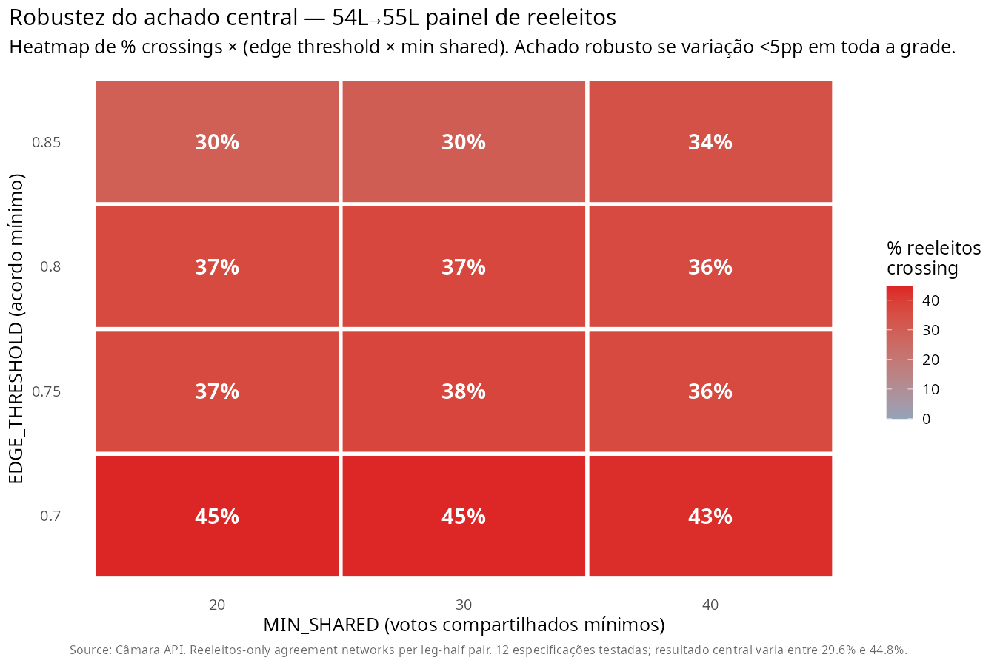
**Figure F1.** Crossing under the twelve-cell grid of edge thresholds (0.70–0.85) and shared-vote
cutoffs (20–40); the 54L→55L crossing stays in [29.6%, 44.8%] throughout (§5.8).

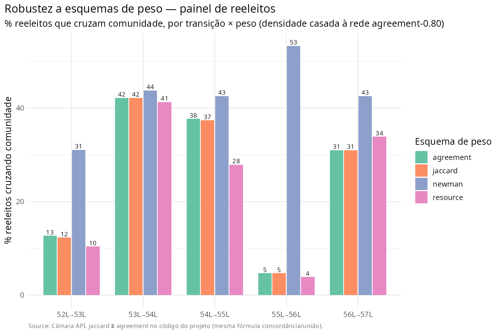
**Figure F2.** Crossing under alternative projection weightings (Jaccard, resource-allocation,
Newman co-participation); the result collapses only under Newman, which carries almost no community
structure (§5.8).

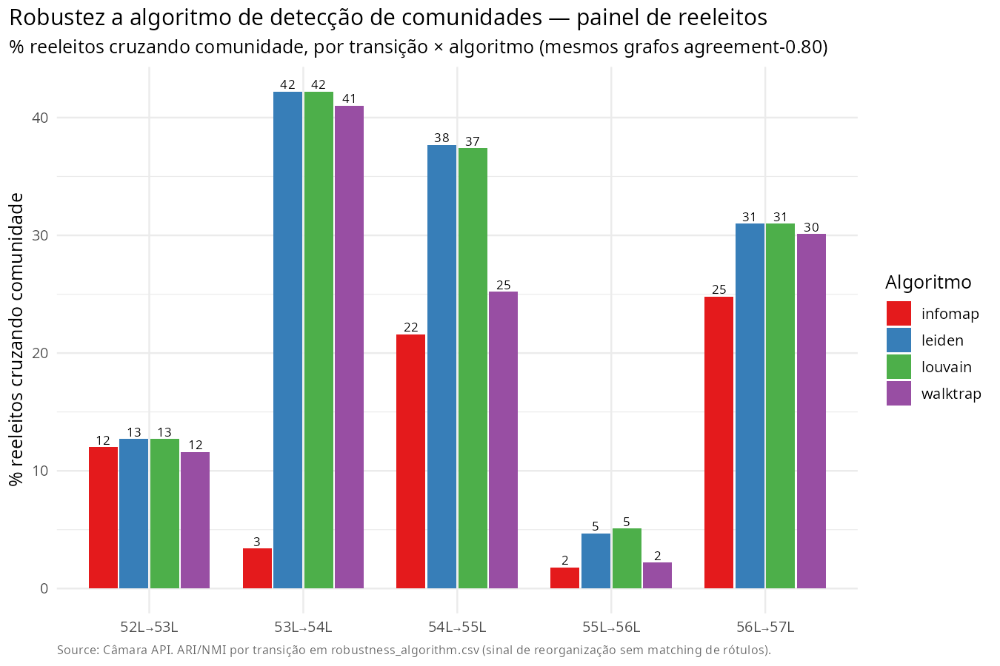
**Figure F3.** Crossing and label-free ARI/NMI across four community-detection algorithms (Louvain,
Leiden, Infomap, Walktrap); the crisis transition is the least similar under all four (§5.8).

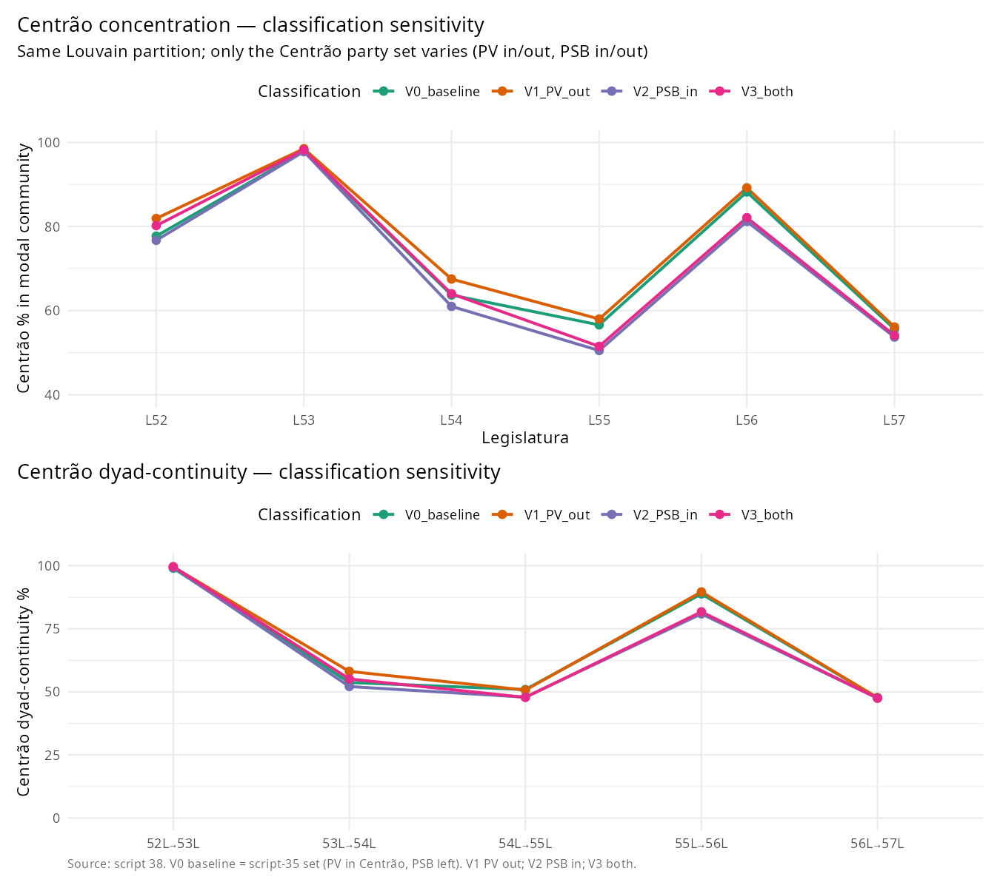
**Figure F4.** Centrão concentration and dyad-continuity under six membership schemes; the
trajectory survives, and dating strengthens the pre-crisis antiquity of the bloc (§5.7, §5.8).

---

## Appendix G — Supplementary figures

Two figures in the main text have an alternative encoding collected here, kept out of the body to
limit the figure count while preserving the per-legislature detail.

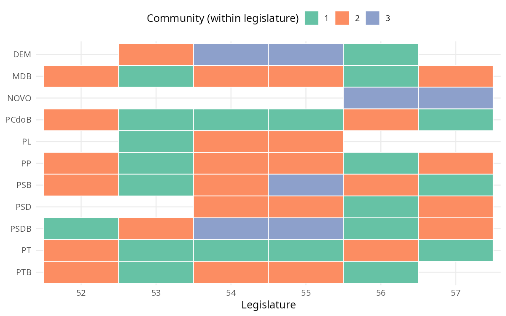
**Figure G1.** Each party's coordinating community by legislature (the heatmap companion to
Figure 4); within a column, cells sharing a colour sit in the same community. The PT and the PMDB
share a community in the 52L–53L and split from the 54L, while the Centrão consolidates around the
MDB after the break (§5.6).

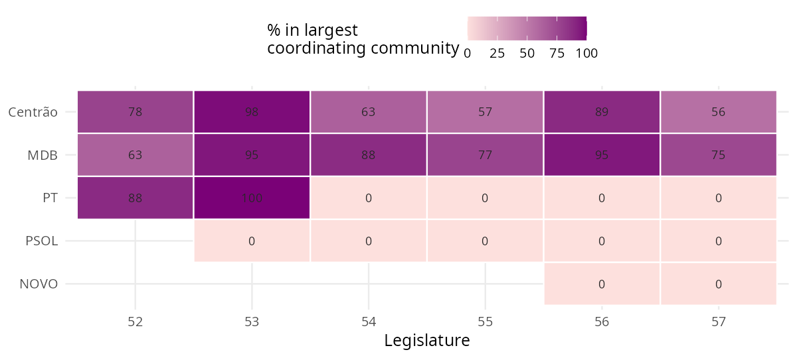
**Figure G2.** Share of each party's deputies sitting in the chamber's largest coordinating
community, by legislature (the heatmap companion to Figure 6). The Centrão and the MDB sit there
throughout; the PT does so only while it governs (52L–53L) and falls to zero from the 54L onward,
including under Lula III (§5.9).
